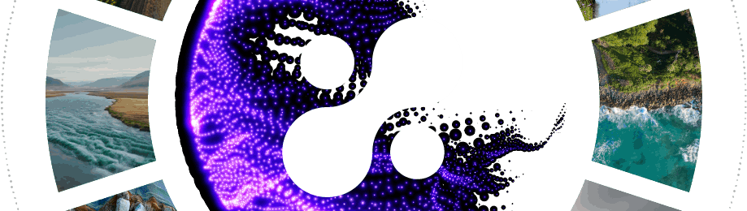

# DEA Hands-on Training 
Living planet Symposium 2025
 
Vienna, Austria
 
22 June 2025 , 15:30-16:50

 Crafting Interactive Stories with DEA
 
From Data to Narrative

This hands-on training will guide participants through the creation of impactful stories using **[DEA](https://dea.destine.eu/web), a Data Visualization and Interactive Storytelling Service**.
DEA supports users in presenting environmental and climate information in a clear and engaging way.
 
The session will introduce DEA, its role within Earth Observation and Climate Change initiatives, and the portfolio of ready-to-use datasets it offers, including climate projections, reanalysis datasets like ERA5, and real-time forecasts data from ECMWF and Copernicus services.
 
Participants will also learn how to enrich their stories by adding external content from researches, local studies, or custom analyses. The presenter will demonstrate how to prepare and process external content — such as maps, charts, or videos generated from satellite-based data or socio-economic statistics — using complementary tools and how to integrate these elements into DEA to enhance the final narrative.
 
The core of the training will focus on hands-on story creation, where participants will practice step-by-step:
- Selecting relevant datasets and defining the narrative angle.
- Creating maps, graphs, and media-rich visualisations.
- Combining data-driven content with textual annotations.

 
By the end of the session, attendees will understand how DEA can be used to present scientific results, support decision-making processes, show effects of extreme events and explain environmental challenges at different scales, from global strategies to local adaptation plans. They will leave with practical skills to use the DEA service and turn their own data and findings into compelling, interactive stories.

## Training Material 

**Training Programme in PDF format**

- [Download Training Programme](DEA_hands-on_training_programme.pdf)

**Download Package Archive**
- [package.zip](https://drive.google.com/file/d/1xOLS6q5O6EeFYXO2mXZgfEkAtdu5QXh-/view?usp=sharing)

### Package archive content:

**3D models:**

- [Download Wind turbine model](package/assets/3D%20models/animated_wind_turbine_lps.glb)
- [Download Solar panel model](package/assets/3D%20models/solar_panel_lps.glb)
- [Download Tree model](package/assets/3D%20models/tree_lps.glb)

**COG files:**

- [Download Etna Sentinel-2 COG](package/assets/COG/2025-02-12S2_Etna_with_snow.tiff)
- [Download Etna Sentinel-3 COG](package/assets/COG/2025-02-12_S3_Etna.tiff)
- [Download Blatten Glacier COG](package/assets/COG/Blatten_glacier_pre_S2_2025-05-18_.tiff)
- [Download Blatten Glacier post collapse COG](package/assets/COG/Blatten_glacier_post_S2_2025-05-30_.tiff)

**Sample images:**

- [Download Atmosphere Image](package/assets/Images/atmosphere_lps25.jpg)
- [Download Climate Image](package/assets/Images/clima_lps25.jpg)
- [Download Coastal Image](package/assets/Images/coastal_lps25.jpg)
- [Download Cryosphere Image](package/assets/Images/cryosphere_lps25.jpg)
- [Download DEA Gallery Image](package/assets/Images/dea_gallery_lps25.png)
- [Download Emergency Image](package/assets/Images/emergency_lps25.jpg)
- [Download Hydrology Image](package/assets/Images/hydrology_lps25.jpg)

**Vector data:**

- [Download Sentinels CZML](package/assets/Vector/copernicus_sentinels_lps.czml)
- [Download Madeira Active Fires KML](package/assets/Vector/EMSR748_AOI01_Madeira_20240819_20240826_activefires_lps.kml)
- [Download Madeira AOI KML](package/assets/Vector/EMSR748_AOI01_Madeira_20240819_20240826_lps.kml)
- [Download Spain Boundaries GeoJSON](package/assets/Vector/es_lps.geojson)
- [Download World Boundaries GeoJSON](package/assets/Vector/world_lps.geojson)

**Sample videos:**

- [Download DEA Intro mp4](package/assets/Videos/background/dea%20intro%20dark.mp4)
- [Download DEA Cover mp4](package/assets/Videos/background/dea_gallery_wave.mp4)
- [Download Time-mean Sea Surface Temperature mp4](package/assets/Videos/avg_tos_DE_D_CDT_black_lps.mp4)
- [Download Meteosaat Third Generation Thermal Channel mp4](package/assets/Videos/mtg_fd_ir105_hrfi_alpha75_compressed_lps.mp4)

